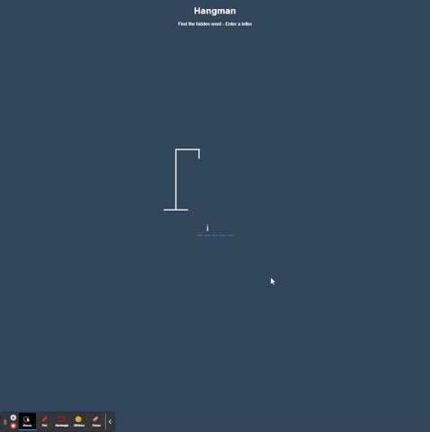

# Hangman Game
Everybody knows how to play Hangman, right?!  This is my web application vesrsion of the game.

## Description
The hidden word is displayed letter by letter as the player guesses and keeps track of wrong guesses while accounting for repeats.

## Tools
HTML, CSS, JavaScript

## Demo



## Features
* I used SVG to draw the gallows and hangman
* Used CSS for styling
* Created a modal like popup to display a win/lost message
* Created a dynamic message in the case of a repeated letter

## Installation
### Browser
* Runs in the browser
* Deployed Link: [https://espinbrandon49.github.io/Hangman/](https://espinbrandon49.github.io/Hangman/)

### Clone
Clone the repository
```bash
git clone https://github.com/espinbrandon49/Hangman.git
```

## License 
### MIT License 
The content of this application is licensed under the MIT License. 

[https://choosealicense.com/licenses/mit/](https://choosealicense.com/licenses/mit/) 

## Contributing 
[Contributor Covenant](https://www.contributor-covenant.org/)


